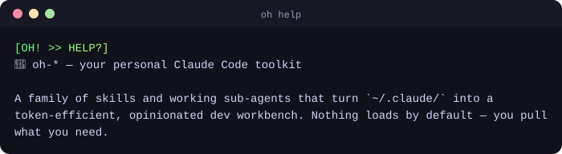
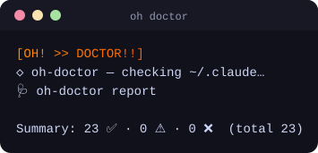
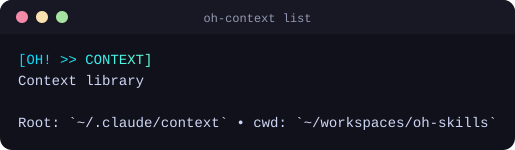

<div align="center">

# 🌸 oh-skills

**A personal dev-cycle toolkit — one source tree, three AI coding agents.**

Plan → implement → review → fix, backed by domain context rules, a local
knowledge base, and forensic bug-tracing. Runs natively on Claude Code,
Antigravity, and OpenAI Codex.

<br/>


</div>

---

## Contents

- [Skills](#skills)
- [Demo](#demo)
- [Quick start](#quick-start)
- [Installation](#installation)
- [Multi-host support](#multi-host-support)
- [Skills in depth](#skills-in-depth)
- [Configuration](#configuration--oh-env)
- [Development](#development)
- [Contributing rules](#contributing-rules)
- [License](#license)

---

## Skills

| Skill              | What it does                                                                       |
| ------------------ | ---------------------------------------------------------------------------------- |
| **oh-nice**        | Plan / update-plan / go / review / fix / do orchestration                          |
| **oh-bug-tracing** | Fix a bug **and** write a forensic `trace.md` — git archaeology + root-cause class |
| **oh-context**     | Dynamic context-rule loader (DO / DO NOT / Details rules per domain)               |
| **oh-search**      | Local knowledge base — check before WebSearch on stable topics                     |
| **oh-doctor**      | Sanity-check the plugin installation                                               |
| **oh-help**        | Reference card with your config substituted in                                     |

---

## Demo

Every skill opens with a signature gradient banner, then emits compact,
scannable output. A few real captures:

<div align="center">



<br/><br/>


&nbsp;&nbsp;


</div>

---

## Quick start

```bash
# In Claude Code
/plugin marketplace add KPJCK/oh-skills
/plugin install oh-skills

# Then, in any project
/oh init      # scaffold .oh-env
/oh doctor    # verify install
/oh help      # see the reference
/oh version   # print release version + commit hash
```

> **Requirements:** [Bun](https://bun.com)
> (`curl -fsSL https://bun.sh/install | bash`), Git, and a supported host.
> `trash` (`brew install trash`) is optional — used by `/oh-search delete`;
> without it those commands fall back to `rm` with a prompt.

---

## Installation

### Claude Code — marketplace

```
/plugin marketplace add KPJCK/oh-skills
/plugin install oh-skills
```

<details>
<summary><b>Claude Code — manual (clone + ask Claude)</b></summary>

Useful when the marketplace mechanism is unavailable, or for forks.

```bash
# 1. Clone the repo to a stable path
git clone https://github.com/KPJCK/oh-skills ~/workspaces/oh-skills
cd ~/workspaces/oh-skills

# 2. Install the JS dependencies
bun install

# 3. Verify the CLI works on its own
bun src/cli.ts help
```

Then **inside Claude Code**, with your repo as the cwd:

```
/plugin marketplace add ~/workspaces/oh-skills
/plugin install oh-skills
/oh doctor
```

Prefer to hand it to an agent? Open Claude Code, point it at the cloned repo,
and prompt:

> Read `README.md` in this repo and follow the **Claude Code — manual** steps.
> Use the path I cloned to (`~/workspaces/oh-skills` unless told otherwise).
> After install, run `/oh doctor` and report any non-green rows.

The agent will clone (if needed), run `bun install`, add the local path as a
marketplace, install the plugin, scaffold `.oh-env` via `/oh init`, and run
`/oh doctor`. It should stop before deleting any pre-existing
`~/.claude/skills/oh-*` directories — you confirm those manually.

</details>

<details>
<summary><b>Antigravity CLI (<code>agy</code>)</b></summary>

Symlink (or copy) the repo into the path where agy looks for plugins, plus the
shared shim anchor, then verify:

```bash
# Stage the plugin in agy's install location (discovery)
mkdir -p ~/.gemini/antigravity-cli/plugins
ln -sfn ~/workspaces/oh-skills ~/.gemini/antigravity-cli/plugins/oh-skills

# Create the shim anchor so SKILL.md shims can locate src/cli.ts at runtime
ln -sfn ~/workspaces/oh-skills ~/.oh-skills

# Confirm agy sees it
agy plugin list
```

You should see `oh-skills` and all six `oh-*` skills. If you prefer not to
symlink, `cp -r` the directory into the discovery path instead.

</details>

<details>
<summary><b>OpenAI Codex</b></summary>

```bash
bash scripts/install-codex.sh
```

The script is idempotent. It (1) creates the `~/.oh-skills` shim anchor, (2)
creates `~/plugins/oh-skills` (Codex marketplace lookup path), (3) installs a
personal `marketplace.json` from the repo template, and (4) registers
`oh-skills@personal` if the `codex` CLI is present (otherwise it prints manual
steps).

After install, start a **new Codex thread** — Codex loads plugins at thread
initialization, not mid-session.

</details>

<details>
<summary><b>Uninstall</b></summary>

```
/plugin uninstall oh-skills
/plugin marketplace remove oh-skills          # or the local-path equivalent
```

To also remove configuration and data:

```bash
rm ~/.claude/.oh-env                          # user-global config
rm <project>/.oh-env                          # per-project config
trash ./.oh                                   # generated rules/knowledge/plans (keep if wanted)
trash ~/workspaces/oh-skills                  # if you cloned manually
```

</details>

---

## Multi-host support

oh-skills runs from **one source tree** on three hosts. Each `skills/*/SKILL.md`
shim locates `src/cli.ts` at runtime via a single stateless, host-portable
expression:

```bash
${CLAUDE_PLUGIN_ROOT:-${ANTIGRAVITY_PLUGIN_ROOT:-${PLUGIN_ROOT:-$HOME/.oh-skills}}}
```

| Host             | Plugin root resolves via | Agent dispatch                        |
| ---------------- | ------------------------ | ------------------------------------- |
| **Claude Code**  | `$CLAUDE_PLUGIN_ROOT`    | Named subagents (Mirai / Yama / Rudy) |
| **Antigravity**  | `~/.oh-skills` anchor    | Dynamic subagents (`self_act`)        |
| **OpenAI Codex** | `~/.oh-skills` anchor    | Dynamic subagents (`self_act`)        |

Only Claude Code exposes named subagents, so on agy and Codex every role
(`CODING_AGENT` / `REVIEW_AGENT` / `RESEARCH_AGENT`) falls back to the main
agent. The planning, review, and fix workflows are otherwise identical across
hosts.

<details>
<summary><b>Plugin-root probe order (the details)</b></summary>

First match wins, defined in `src/shared/plugin-root.ts`:

| Priority | Variable / path           | Set by                                                  |
| -------- | ------------------------- | ------------------------------------------------------- |
| 1        | `CLAUDE_PLUGIN_ROOT`      | Claude Code (always set when a plugin runs there)       |
| 2        | `ANTIGRAVITY_PLUGIN_ROOT` | Reserved for a future agy release — not set today       |
| 3        | `PLUGIN_ROOT`             | Reserved; no known host sets this in skill context      |
| 4        | `$HOME/.oh-skills`        | Unified anchor symlink (shared by agy + Codex installs) |

**Why an anchor?** Neither agy (confirmed via binary forensics on v1.0.3) nor
Codex injects a plugin-root variable into running skills — and Codex's plugin
validator forbids `hooks`, ruling out a hook-based approach. The `~/.oh-skills`
symlink is therefore the resolution mechanism on both, which is why their
install steps create it. The TypeScript resolver additionally probes known
install paths (`~/.oh-skills`, `~/plugins/oh-skills`,
`~/.gemini/antigravity-cli/plugins/oh-skills`) for its own internal needs.

</details>

<details>
<summary><b>Codex skill compatibility</b></summary>

Codex's plugin validator requires `disable-model-invocation` to be `false` or
absent. The utility skills (`oh-context`, `oh-search`, `oh-doctor`, `oh-help`)
satisfy this and load on Codex. The two action/orchestration skills (`oh-nice`,
`oh-bug-tracing`) intentionally keep `disable-model-invocation: true` to stay
user-only on Claude Code, so Codex's strict validator does not ingest them —
drive those flows directly on Codex if you need them there.

</details>

---

## Skills in depth

### oh-nice

```
/oh-nice plan "<feature description>"         → brainstorm + write spec.md + plan.md
/oh-nice update-plan "<new request>"          → append updates to an existing plan
/oh-nice go                                   → implement
/oh-nice review                               → review the changes against the plan
/oh-nice fix                                  → apply the latest review feedback
/oh-nice do "<one-shot request>"              → implement → review → fix, no plan artifacts
```

**Parallel execution (DAG-driven).** Plans authored via `/oh-nice plan` include
per-task `**Files:**` and `**Depends-on:**` annotations. When `/oh-nice go` sees
these, it parses the plan into a dependency DAG, validates it (cycle detection,
file-collision checks), and dispatches multiple coding agents concurrently for
tasks whose dependencies are met. Concurrency caps at 3 by default (override
with `OH_NICE_MAX_PARALLEL`). Plans without DAG annotations fall back to
single-agent sequential mode — no migration required.

<details>
<summary><b>The <code>do</code> one-shot loop & research modes</b></summary>

Use `do` for quick tasks that don't need a stored plan. Same implement → review
→ fix loop, no artifacts under `PLAN_DIR`. Opt out of later phases with
`--no-review` or `--no-fix`:

```
/oh-nice do "rename foo to bar"
  → coding agent implements + commits
  → review agent checks diff vs origin/main, writes findings to os.tmpdir()
  → fix agent applies findings, tmp file deleted

/oh-nice do "add a TODO comment" --no-review   → implement only
/oh-nice do "add a TODO comment" --no-fix       → implement + review, findings left for you
```

Both `plan` and `update-plan` include an **optional research step** after
brainstorming:

| Mode        | Behaviour                                                                                |
| ----------- | ---------------------------------------------------------------------------------------- |
| `knowledge` | Searches the local oh-search knowledge base only; leaves spec.md unchanged if no matches |
| `online`    | Skips local search; uses WebSearch + WebFetch directly (3-5 sources per topic)           |
| `auto`      | Local-first; falls back to web for topics with no local hit                              |

The research agent appends a `## Research` section to `spec.md` (or a
`### Research` subsection under the latest `## Update` block for `update-plan`).
After online research you're asked whether to save findings to the knowledge
base.

</details>

### oh-bug-tracing

```
/oh-bug-tracing fix "<bug description or pasted error/log>"
  → phase 1: coding agent fixes the bug
  → phase 2: main thread does git archaeology — finds the introducing commit,
             reconstructs the original dev's intent, classifies root cause,
             writes trace.md to PLAN_DIR/<repo>/<bug-slug>/trace.md
```

`trace.md` has eight enforced sections: Symptom · Fix · Origin (commit/PR) · Dev
intent · Why this slipped · Root cause class · Prevention (TODO checkboxes) ·
External research. Use it when an ad-hoc bug deserves to leave behind
institutional memory, not just a fix.

### oh-context

```
/oh-context load                              → pick context folders, inject their rules
/oh-context list                              → list available folders
/oh-context check                             → drift detector — verify the host still has the rules
/oh-context add                               → scaffold a new rule-*.md
/oh-context promote --all                     → convert drafts (.md) to rule-*.md
```

### oh-search

```
/oh-search find "<query>"                     → check the local knowledge base first
/oh-search research "<query>"                 → directive to WebSearch + save after YES confirm
/oh-search list                               → browse what's saved
```

---

## Configuration — `.oh-env`

`/oh init` scaffolds either `./.oh-env` (project, gitignored) or
`~/.claude/.oh-env` (user-global). Project values override home values per-key;
process environment variables override both.

```bash
CONTEXT_DIR=./.oh/context                     # rule-*.md storage
CONTEXT_TEMPLATE_DIR=./.oh/context-templates  # rule-set presets
KNOWLEDGE_DIR=./.oh/knowledge                 # search-*.md storage
PLAN_DIR=./.oh/plan                           # <repo>/<slug>/{spec,plan,review}.md

CODING_AGENT=      # optional; empty = main agent implements
REVIEW_AGENT=      # optional; empty = main agent reviews
RESEARCH_AGENT=    # optional; empty = main agent researches
```

Set the agent vars if you have a personal implementer/reviewer registered as a
Claude Code sub-agent. Otherwise leave them empty and the main conversation
handles those roles. (On Antigravity and Codex they're ignored — see
[Multi-host support](#multi-host-support).)

---

## Development

```bash
git clone https://github.com/KPJCK/oh-skills
cd oh-skills
bun install
bun test
```

Local install for development:

```
/plugin marketplace add /absolute/path/to/oh-skills
/plugin install oh-skills
```

<details>
<summary><b>Long-session token health</b></summary>

Token context fills up over a long session. Compact before it impacts quality.

**Caps (post-compaction estimates):** single skill invocation ~5K tokens;
combined re-attach budget ~25K (newest-first). Hit either cap → compact before
the next heavy command.

**When:** after `go` finishes, after `review` returns, or whenever `/oh-nice`
responses feel sluggish.

```
/compact focus on <current-task>
```

**Compact-instructions block** — paste in after any compact to restore skill
state:

```
## Compact Instructions

Skills active: oh-nice / oh-bug-tracing / oh-context / oh-search / oh-doctor / oh-help.
Run: bun ${CLAUDE_PLUGIN_ROOT}/src/cli.ts <skill> <subcommand> [flags].
Sentinel: __OH_NICE_NEXT_ACTIONS__<json> (stderr last line) — parse and execute.
Env: PLAN_DIR / CONTEXT_DIR / KNOWLEDGE_DIR / CODING_AGENT / REVIEW_AGENT from .oh-env.
Next action: [fill in what you were doing].
```

After compact, run `/oh-context check` to verify rules survived;
`/oh-context load` to reload if not.

</details>

---

## Contributing rules

These apply to every change made to this repository.

1. **Always update `CHANGELOG.md`.** Every code-changing commit appends at least
   one entry under `## [Unreleased]`, grouped into `Added` / `Changed` / `Fixed`
   / `Removed` ([Keep a Changelog](https://keepachangelog.com/) format).
   CHANGELOG-only commits are exempt.
2. **Version sync.** `package.json` and `.claude-plugin/plugin.json` must carry
   the same `version`. CI fails if they drift (`scripts/check-version.ts`).
3. **No hardcoded paths or agent names** in `src/`. Paths come from `.oh-env`
   via `loadOhEnv()`; agent roles from `resolveAgent(role, env)`.
4. **Tests first** for new behavior in `src/env.ts`, `src/cli.ts`,
   `src/shared/`. Port-only changes can skip TDD when the test already exists.
5. **Bun-only.** No Node-only APIs that don't work on Bun; no
   `npm`/`pnpm`/`yarn` scripts.

---

## License

[MIT](LICENSE) © KPJCK
